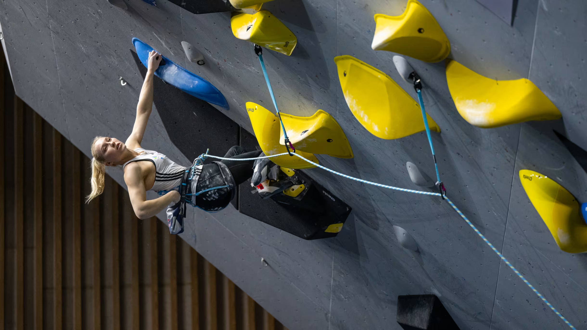

# 🧗‍♀️Does a country’s wealth affect climbing performance? A data analysis of IFSC results and GDP
By Buket Çakır

DSA210 Term Project

---

### Hypothesis: Athletes from higher GDP countries tend to achieve stronger and more consistent performance in IFSC World Cup climbing events.

  

# Project Overview

Climbing is a sport that combines physical strength, technique, problem-solving, and mental focus. In competition climbing particularly in IFSC World Cup events, athletes face routes designed to test their endurance, precision, and adaptability under time pressure.

This project investigates whether economic factors at the country level, specifically GDP per capita, are associated with better competitive outcomes in professional climbing. In this project, GDP per capita is used to represent the economic resources available in each athlete’s home country. By merging this dataset with the IFSC competition results using the athletes’ nationality, the analysis investigates whether climbers from wealthier countries tend to achieve better and more consistent competition results.

# Data Collection
To explore this relationship, I combine:

Athlete-level performance data from IFSC competitions, and

Country-level GDP per capita data from the World Bank.

The datasets that will be used in this project will be obtained from Kaggle. They are titled as “IFSC Competition Climbing Results (1991–2024)” and "Global GDP Per Capita (1990-2023) - World Bank".

Sources: 

https://www.kaggle.com/datasets/mxmlnv/ifsc-competition-climbing
This dataset contains publicly available results and athlete information scraped from the official IFSC website. It includes data on competition results, athlete profiles, and event details across multiple climbing disciplines from 1991 to 2024. The dataset consists of two files: one containing information about events such as competition name, year, location, discipline, and round, and another containing athlete-specific data including athlete name, nationality, rank, score, and time.

https://www.kaggle.com/datasets/gauravkumar2525/global-gdp-per-capita-1990-2023-world-bank
This dataset provides country-level economic data sourced from the World Bank. It contains annual values of GDP per capita for countries across the world between 1990 and 2023. GDP per capita is often used to reflect how financially developed or wealthy a country is, and it gives a general idea of the living standards in that country.

By merging these datasets using each athlete’s nationality, I analyze whether athletes from economically stronger countries tend to achieve better competition rankings and show more consistent performance throughout the season.

Since the datasets are already available publicly, the data collection step will involve:

-Downloading the dataset from Kaggle.

-Cleaning and organizing the data (handling missing values, filtering event types).

-Extracting the relevant variables that show athlete performance history and merging them with each athlete’s country-level GDP per capita.

# Planned Analysis

Exploratory Data Analysis (EDA): Distribution of rankings, event counts, and average scores, correlations between participation and placement.

Visualization: Scatter plots, trend lines, and discipline specific comparisons.

# Expected Outcome

I expect to observe a positive trend, climbers from higher-GDP countries will show:

-a higher probability of finishing in the top rankings

-stronger and more consistent historical performances

However, I also expect overlap and exceptions, showing that while economic resources help, individual talent and opportunity can still emerge from lower income countries.

# Tools and Environment

Python (pandas, numpy, matplotlib, seaborn)

Google Collab

GitHub for version control and documentation

