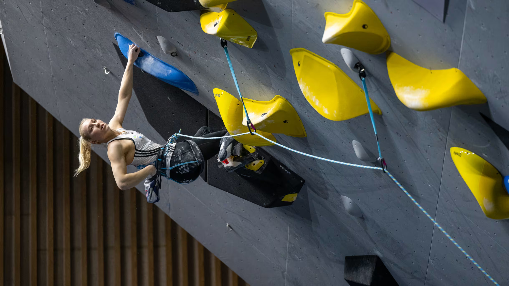

# 🧗‍♀️Does a country’s wealth affect climbing performance? A data analysis of IFSC results and GDP
By Buket Çakır

DSA210 Term Project

---

### Hypothesis: Athletes from higher GDP countries tend to achieve stronger performance in IFSC World Cup climbing events.

  

-----

# Project Overview

Climbing is a sport that combines physical strength, technique, problem-solving, and mental focus. In competition climbing particularly in IFSC World Cup events, athletes face routes designed to test their endurance, precision, and adaptability under time pressure.

This project investigates whether economic factors at the country level, specifically GDP per capita, are associated with better competitive outcomes in professional climbing. In this project, GDP per capita is used to represent the economic resources available in each athlete’s home country. GDP per capita in this study is measured in PPP (constant 2021 international dollars), which adjusts for both differences in cost of living between countries and inflation over time. This allows for a fairer comparison of countries’ real economic conditions across different years. By merging this dataset with the IFSC competition results using the athletes’ nationality, the analysis investigates whether climbers from wealthier countries tend to achieve better and more consistent competition results.

----

# Motivation

Sport performance is often explained through individual talent, dedication, and training quality. However, access to high quality facilities, professional coaching and competition opportunities is not equally distributed across the world. These resources are strongly influenced by a country’s economic situation, which may create advantages or disadvantages for athletes before they even start competing.

While climbing is a global sport, elite climbing requires access to indoor climbing walls, advanced equipment, and professional training and competition exposure, which are all more available and accessible in economically developed countries.

I was curious about whether a country’s level of economic development has any real impact on the success of its athletes in international climbing competitions. By combining IFSC World Cup results with GDP per capita data, this project explores whether national wealth is linked to stronger and more consistent performance, or whether climbing remains a sport where success can emerge regardless of economic background.

Understanding this relationship not only provides insight into inequalities in sports development, but also challenges assumptions about what determines high performance on the global stage. To explore this further, I will also perform a subgroup analysis by gender to test whether the relationship between GDP and performance varies between male and female athletes.

-------

# Data Collection

Two datasets were used to create the finalised dataset:

## 1. IFSC Competition Results

Source: Kaggle – “IFSC Competition Climbing Results (1991–2024)”

This dataset contains publicly available results and athlete information scraped from the official IFSC website. It includes data on competition results, athlete profiles, and event details across multiple climbing disciplines from 1991 to 2024. The dataset consists of two files: one containing information about events such as competition name, year, location, discipline, and round, and another containing athlete-specific data including athlete name, nationality, rank, score, and time.

Link:
https://www.kaggle.com/datasets/mxmlnv/ifsc-competition-climbing

## 2. GDP Per Capita Data

Source: Kaggle – “Global GDP Per Capita (1990–2023) – World Bank”

This dataset provides country level economic data sourced from the World Bank. It contains annual values of GDP per capita for countries across the world between 1990 and 2023. GDP per capita is often used to reflect how financially developed or wealthy a country is, and it gives a general idea of the living standards in that country.

Link:
https://www.kaggle.com/datasets/gauravkumar2525/global-gdp-per-capita-1990-2023-world-bank

By merging these datasets using each athlete’s nationality, I analyzed whether athletes from economically stronger countries tend to achieve better competition rankings and show more consistent performance throughout the season.

## The data collection step involved:

-Downloading the dataset from Kaggle.

-Cleaning and organizing the data (handling missing values, keeping only thee required columns).

-Limiting the IFSC data to match the available GDP years (≤ 2023)

-Extracting the relevant variables that show athlete performance history and merging them with each athlete’s country-level GDP per capita.

-To create a fair, country based dataset for analysis, data was aggregated at a country season level by calculating the Mean rank, mean GDP per capita
 and event participation count

-------

# Analysis Performed

## The following analyses were conducted:

-Exploratory Data Analysis (EDA)

-Distribution of IFSC ranks

-Distribution of GDP per capita for participating countries

-Scatter plots of GDP vs rank

-Country-season average rank analysis

-GDP quartile grouping and rank comparison  

## The following statistical tests were performed:

-Pearson correlation

-Spearman correlation

-Two-sample t-test between low-GDP and high-GDP groups

-Subgroup analysis by gender using both Pearson and Spearman correlations

## The following machine learning models were used:

 -Linear regression to model average country-season rank  
 
 -Logistic regression to classify top performing country-seasons

### The Machine Learning Approach Explained

Supervised machine learning models were applied at the country-season level.

Each country-season observation includes:
- GDP per capita
- 
- Number of events participated in
- 
- Season (year)
- 
- Gender (encoded as a binary variable)
- 

In the regression model, the goal was to predict the average IFSC rank of a country in a given season.

For classification, countries were grouped into two categories based on performance. If the average rank was 20 or better, it was labeled as Top 20; otherwise, it was labeled as Non Top 20.
I used top 20 athletes for evaluating better performing athletes.

The dataset was split into training and testing sets using an 80/20 train-test split.

-----

# Observed Outcome

The analysis shows a weak but statistically significant negative relationship between a country’s GDP per capita and IFSC athlete rankings where lower rank means better performance.

Pearson correlation: r ≈ –0.14, p < 0.001

Spearman correlation: ρ ≈ –0.15, p < 0.001

This indicates that athletes from countries with higher GDP per capita tend to achieve slightly better (lower) average rankings, but the relationship is weak, meaning that GDP alone explains only a small part of performance variance.

The two-sample t-test comparing low-GDP and high-GDP groups also revealed a statistically significant difference in mean rank, confirming that athletes from wealthier countries, on average, place higher in competitions.

## Subgroup analysis by gender showed:

A significant relationship for male athletes

A much weaker and statistically insignificant relationship for female athletes

This suggests that while national economic conditions may have a small influence on climbing performance, individual talent, training environment, and other social or structural factors play a far larger role in determining competitive success.

## Machine Learning Results

A linear regression model was used to predict average IFSC rank at the country-season level.  
The model achieved:

- Training R² = 0.20  
- Test R² = 0.20 

This indicates that the model explains %20 of the variance in average ranking. GDP per capita has a negative coefficient which means higher GDP is associated with better (lower) average rank. But most variation in performance still remains unexplained which suggests that economic indicators alone are insufficient predictors of climbing success.

A logistic regression model was then applied to classify whether a country-season achieved a **Top 20 average rank**.

- Classification accuracy = 75%

The model performs well at identifying non top performing country-seasons but struggles to correctly classify top performing ones. This reflects class imbalance in the data and suggests that while GDP helps distinguish general performance levels, they are less effective at predicting elite level outcomes.

-----

# Tools and Environment

Python (pandas, numpy, matplotlib, seaborn, scipy, scikit-learn)  

Google Collab

GitHub for documentation

